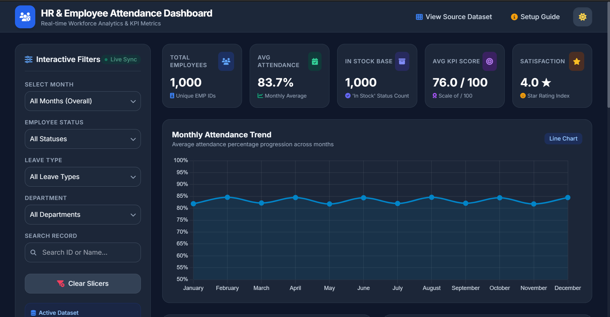
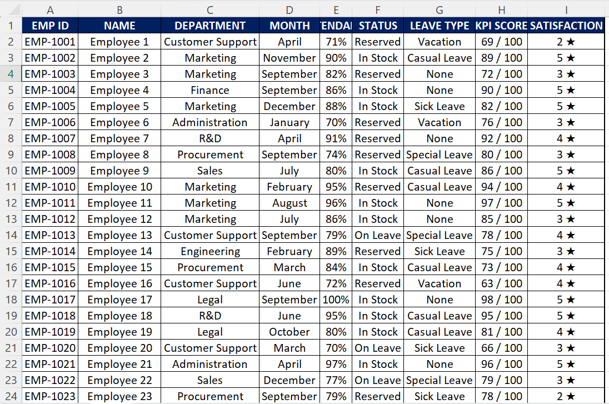

# 📊 AI-Powered HR & Employee Attendance Dashboard


-blue?style=for-the-badge&logo=googlegemini)


A fully interactive, responsive **HR & Employee Attendance Dashboard** built in under 2 minutes using the **100% FREE version of Google Gemini AI Canvas**. 

This repository contains the dataset, master prompt, and generated production-ready HTML dashboard code shown in the YouTube tutorial.

---

## 🖼️ Dashboard Preview

### 1. Interactive HR Dashboard (Dark & Light Mode)
> *Generated web interface featuring interactive slicer filters, real-time KPI metrics, and Chart.js analytics.*



---

### 2. Source HR Dataset (Excel / CSV)
> *Raw employee records with attendance, leave split, KPI scores, and satisfaction ratings.*



---

## 🌟 Key Features

* **100% Free Implementation:** Built using Gemini AI Canvas without any paid subscriptions or coding.
* **Interactive Slicers:** Filter metrics live by **Month**, **Status**, and **Leave Type**.
* **Key KPI Summary Cards:** Instant recalculations for Total Employees, Attendance Rate, Active Base, KPI Scores, and Satisfaction Index.
* **Dynamic Visualizations:** Includes Chart.js line charts, donut charts, and bar charts.
* **Theme Switching:** Built-in Light and Dark Mode toggle.
* **Offline Ready:** Single self-contained `.html` file that opens directly in any web browser.

---

## 📁 Repository Structure

```text
├── README.md
├── Master_Prompt.txt
├── Employees_1000_Styled_Data.csv
├── HR_Attendance_Dashboard.html
└── images/
    ├── dashboard.jpg
    └── excel.jpg
```

🚀 Quick Setup & Installation
Option 1: Direct File Download (Instant Access)
Clone or download this repository to your local machine:

Bash
git clone [https://github.com/srichandratech-del/AI-Powered-HR-Employee-Attendance-Dashboard] https://github.com/srichandratech-del/AI-Powered-HR-Employee-Attendance-Dashboard)
1. Open the project folder and double-click `HR_Attendance_Dashboard.html`.
2. The dashboard will launch directly in your default web browser without setting up any server environment.

### Option 2: Generate Live via Gemini AI Canvas

1. Log in to [Google Gemini](https://gemini.google.com) (Free Version).
2. Switch to **Canvas mode**.
3. Copy the master prompt from `Master_Prompt.txt`.
4. Attach the `Employees_1000_Styled_Data.csv` dataset file.
5. Paste the prompt, hit **Send**, and download your generated `.html` file directly from Canvas.

## 🛠️ Data Schema & Code Architecture

The dashboard parses client-side CSV data and transforms raw attributes into interactive visualizations:

| CSV Column | Data Type | Parsing Logic / Calculation | Dashboard Component |
| :--- | :--- | :--- | :--- |
| **`EMP ID`** | String | Counts unique records (`count()`) | Total Employees KPI Card |
| **`NAME`** | String | Raw employee identifiers | Detail Context |
| **`DEPARTMENT`** | String | Grouping key (`Finance`) | Metric Filters & Grouping |
| **`MONTH`** | String | Date index (`January` - `December`) | Sidebar Slicer & Line Chart |
| **`ATTENDANCE`** | String | Strips `%` and converts to Float | Attendance Rate KPI & Trend Line |
| **`STATUS`** | Categorical | Filter match (`In Stock` / `Reserved`) | Sidebar Slicer & Status Donut Chart |
| **`LEAVE TYPE`** | Categorical | Group sum (`Casual` vs `Special`) | Sidebar Slicer & Leave Pie Chart |
| **`KPI SCORE`** | String | Extracts integer before `/ 100` | Avg KPI Score Card & Bar Chart |
| **`SATISFACTION`** | String | Extracts integer before `★` rating | Satisfaction Index KPI Card |

---

## 🎥 YouTube Video Tutorial

Watch the complete step-by-step video tutorial explaining how to build and customize this interactive dashboard for free:

[](https://youtu.be/XF7l7f644y0)

> 📌 **Video Link:** [Click here to watch the full tutorial on YouTube](https://www.youtube.com/watch?v=YOUR_VIDEO_ID_HERE)  
> 🔔 **Subscribe:** [Subscribe to the channel for more free AI & Data tutorials!](https://www.youtube.com/@app_hacks_hq)

## 📝 License

This project is open-source and free to use for personal, educational, or professional demonstration purposes.
